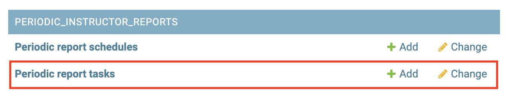
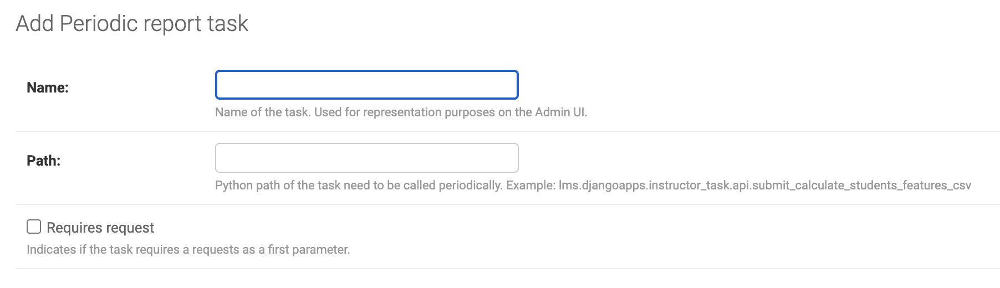
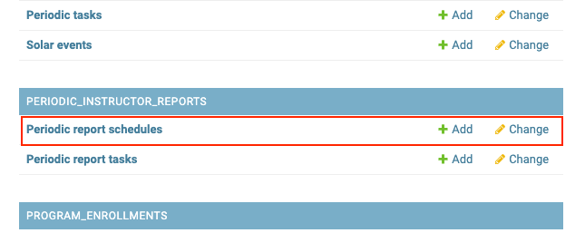
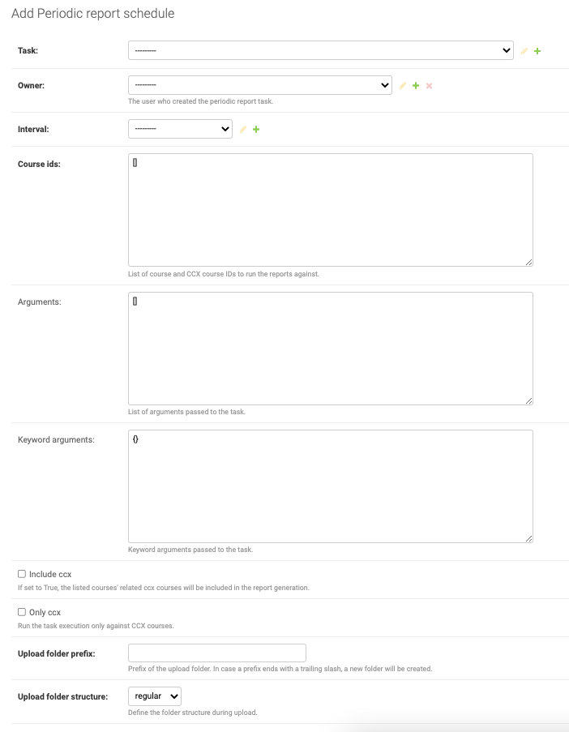

# Periodic Instructor Reports

Although the edX platform does offer instructor reports, those cannot be generated automatically. Every time an instructor would like to generate reports, the report generation must be triggered manually on the UI.

The [periodic instructor reports](https://gitlab.com/opencraft/client/esme-learning/periodic-instructor-reports) Django Plugin App makes it possible to run qualified instructor report tasks periodically. An instructor report is qualified if, and only if, it can be scheduled as a background task using [Celery](https://docs.celeryproject.org/en/stable/) (ie. it is decorated by @task) and using or passing the keyword arguments to the background task that will be scheduled. That means those reports that are generated on-the-fly are not available for periodic generation at the moment.

## Currently Supported Reports

The following reports are qualified at the time of writing:

- [Grade Report](https://github.com/edx/edx-platform/blob/37aa2db9e30bdc4d971dc361134193a69ad7a105/lms/djangoapps/instructor_task/api.py#L348)
- [Problem Grade Report](https://github.com/edx/edx-platform/blob/37aa2db9e30bdc4d971dc361134193a69ad7a105/lms/djangoapps/instructor_task/api.py#L360)
- [Profile Information Report](https://github.com/edx/edx-platform/blob/37aa2db9e30bdc4d971dc361134193a69ad7a105/lms/djangoapps/instructor_task/api.py#L372) (list of students enrolled in the course)

Besides these reports, it is possible to add more reports to the list of supported reports. On-the-fly reports can be supported as well by wrapping them in a custom background task as part of this Plugin App.

## Add Or Edit Supported Reports

Configuring periodic report generation requires admin privileges on the LMS. Although this model is simple, it should be edited by developers as it has big effect on the periodic reports later.

To register a new report task, navigate to the LMS admin site, search for the "Periodic report tasks" and click it.



A list of schedules will appear. By clicking the "ADD PERIODIC REPORT TASK" button in the top right corner, it is possible to add new schedules. In case an existing schedule should be adjusted, click on the schedule task name (the value of the first column).



On the newly appeared page, the `Name` and `Path` fields are required.

* `Name` - any descriptive name that identifies the task, it can be any name
* `Path` - the Python dotted path of the function that will be called
* `Requires request` - indicates if the first argument of the called path is a request or not

Example: [Periodic Instructor Report Task](docs/img/periodic-instructor-report-task-example.png)

## Create Or Edit Schedules

Configuring periodic report generation requires admin privileges on the LMS.

To create a new periodic report schedule or edit an existing one navigate to the admin site of your Open edX installation and search for "Periodic report schedules" and click it.



A list of schedules will appear. By clicking the "ADD PERIODIC REPORT SCHEDULE" button in the top right corner, it is possible to add new schedules. In case an existing schedule should be adjusted, click on the schedule task name (the value of the first column).



On the newly appeared page, the `Task`, `Owner`, `Interval`, `Course ids`, `Upload folder prefix` and `Upload folder structure` fields are required.

* `Task` - represents one of the available and qualified reports (mentioned above)
* `Owner` - represents the person who creates the schedule
* `Interval` - sets the frequency of the report generation, in case the desired interval is not available, by clicking the green plus sign next to it, new intervals can be added
* `Course ids` - JSON list of course IDs or CCX IDs that will be used during report generation (example: `["course-v1:AB+CD+06+2020", "course-v1:AB+C+06+2021"]`)
* `Upload folder prefix` - sets the prefix of the repors, if the prefix ends with a slash (`/`), the the reports will be uploaded to a specific folder (example: `periodic-reports/` or `periodic-`)

* `Upload folder structure` - defines the structuring of the upload folder, three different structures can be selected:
    * `regular` - the usual way of the reports are uploaded by the edX platform, uses the hashed course ID, prefix and report name
    * `by_date` - similar to `regular`, but instead of the hashed course ID, the current date (`yyyy-mm-dd` format) will be used
    * `flat` - no intermediate folders will be used, only the prefix and report name

Example: [Periodic Instructor Report Schedule](docs/img/periodic-instructor-report-schedule-example.png)

## Installation On An edX Instance

To properly provision an edX instance, set the following configuration options should be set in prior to any app server provisioning.

```yaml
# If provisioned using Ocim
# SANDBOX_ENABLE_REDIS: true

EDXAPP_ENABLE_CELERY_BEAT: true
EDXAPP_CELERYBEAT_SCHEDULER: 'django_celery_beat.schedulers:DatabaseScheduler'
EDXAPP_CELERY_BROKER_HOSTNAME: 'redis.example.com' ## replace with your redis address
EDXAPP_CELERY_BROKER_TRANSPORT: redis
EDXAPP_CELERY_BROKER_USE_SSL: false  ## set to true if you are using redis over SSL
EDXAPP_CELERY_BROKER_VHOST: 0  ## set to the desired redis DB
EDXAPP_CELERY_PASSWORD: ''  ## set to redis user password
EDXAPP_CELERY_USER: default  ## set to the desired redis user

EDXAPP_EXTRA_REQUIREMENTS:
  - name: 'git+https://gitlab.com/opencraft/client/esme-learning/periodic-instructor-reports.git@master#egg=periodic-instructor-reports'

EDXAPP_LMS_ENV_EXTRA:
  ADDL_INSTALLED_APPS:
  - django_celery_beat

EDXAPP_CMS_ENV_EXTRA:
  ADDL_INSTALLED_APPS:
  - django_celery_beat
```

## Run In edX Devstack

Devstack won't run the Celery message broker by default. To start the redis broker, run `make dev.up.redis`.

```shell
# In the devstack repository
make dev.up.redis
```

After the redis broker started, start the workers within the lms shell seen below.

```shell
# Activate the virtualenv
cd /edx/app/edxapp/
source /edx/app/edxapp/edxapp_env

# Run paver
paver celery

# Or optionally, in the lms shell, start the worker manually
# DJANGO_SETTINGS_MODULE=lms.envs.devstack_with_worker celery worker --beat --app=lms.celery:APP -Q edx.core.default
```

## Run Tests

```plaintext
PYTHONPATH=$(pwd) DJANGO_SETTINGS_MODULE=test_settings django-admin test
```